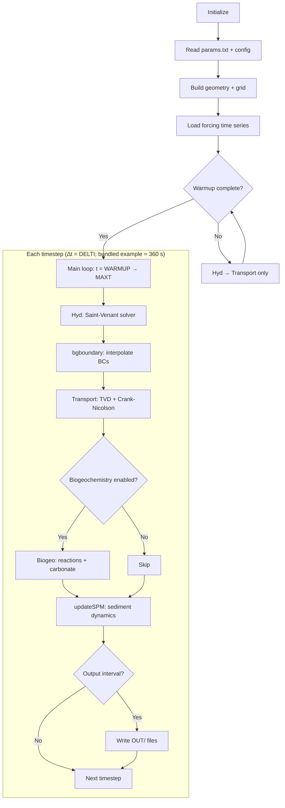
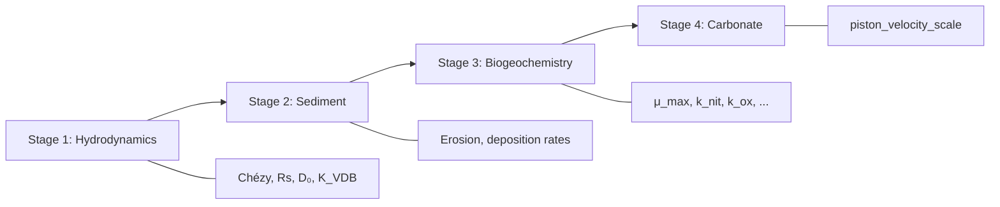
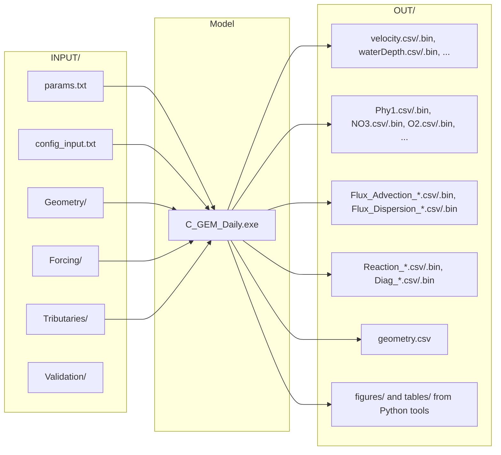

# Supplement 3 — Model Flowcharts

## Main Simulation Loop



## Biogeochemical Reaction Network

```mermaid
flowchart TD
    subgraph "Primary Production"
        PP[μ = μ_max × f(T) × f(I) × min(fN, fP, fSi)]
        PP --> Phy1[Phy1: Diatoms]
        PP --> Phy2[Phy2: Non-diatoms]
    end
    
    subgraph "Nutrient Uptake"
        Phy1 --> NO3[NO₃ uptake]
        Phy1 --> NH4u[NH₄ uptake]
        Phy1 --> Si_u[Si uptake]
        Phy2 --> NO3
        Phy2 --> NH4u
        Phy1 --> PO4u[PO₄ uptake]
        Phy2 --> PO4u
    end
    
    subgraph "Losses & Recycling"
        Phy1 --> MORT[Mortality → TOC]
        Phy2 --> MORT
        TOC_pool[TOC] --> ADEGRAD[Aerobic degradation]
        ADEGRAD --> NH4r[NH₄ release]
        ADEGRAD --> PO4r[PO₄ release]
        ADEGRAD --> DIC_up[DIC increase]
        ADEGRAD --> O2_down[O₂ consumption]
    end
    
    subgraph "Nitrogen Transformations"
        NH4r --> NIT[Nitrification: NH₄ → NO₃]
        NIT --> O2_down
        NO3 --> DENIT[Denitrification: NO₃ → N₂]
    end
    
    subgraph "Gas Exchange"
        O2_ex[O₂ air-water exchange]
        CO2_ex[CO₂ air-water exchange]
    end
    
    subgraph "Carbonate System"
        DIC_up --> pH_solve[pH solver: DIC + AT → pH, pCO₂]
        CO2_ex --> DIC_up
    end
```

## Calibration Stages



## File I/O Structure


